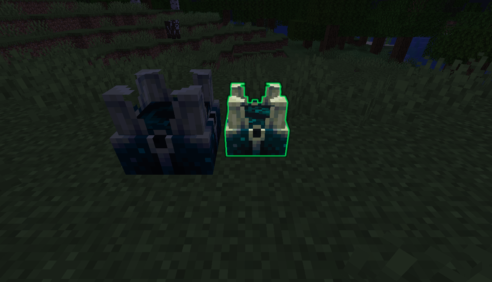
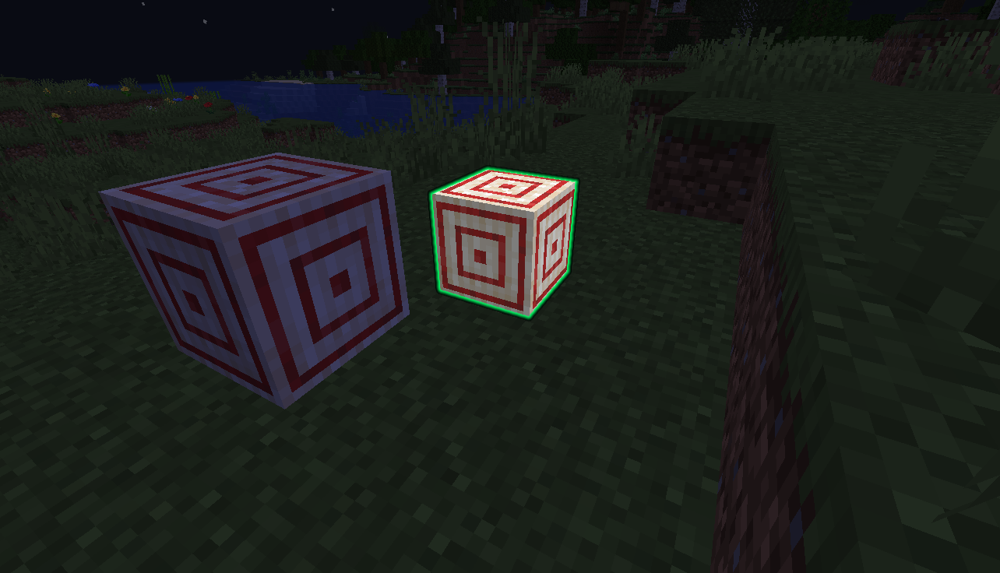

<div align="center">

# BuildPreview

### See where your block will be placed — before you place it.

A lightweight **Paper 1.21+** plugin that renders a ghost preview block at the exact placement position using the modern **BlockDisplay** entity.
**No dependencies. No configuration. Just install and build.**

[](https://github.com/wjddusrb03/BuildPreview/releases/latest)


**[English](#features)** · **[한국어](#기능)**

</div>

---

## Screenshots

<div align="center">

| Placed block vs Preview | Preview with green glow |
|:-:|:-:|
|  |  |

*The green-glowing smaller block is the placement preview. Only you can see it!*

*초록색으로 빛나는 작은 블록이 설치 미리보기입니다. 본인에게만 보입니다!*

</div>

---

## Features

| Feature | Description |
|---------|-------------|
| **Real-time ghost preview** | A 70%-scale translucent block appears exactly where you're about to place, updating every 3 ticks (~150ms) |
| **Player-specific visibility** | Only you can see your own preview — other players are never distracted |
| **Green glow outline** | The preview block glows green, clearly distinguishing it from real blocks |
| **Smooth movement** | Uses teleport interpolation so the preview slides fluidly as you look around |
| **Replaceable block awareness** | Correctly shows the preview on grass, ferns, dead bushes, vines, snow layers, and other replaceable blocks |
| **Toggle command** | `/bp` to turn your personal preview on or off at any time |
| **Zero world persistence** | Preview entities are **never saved** to world files — guaranteed no ghost blocks after server restarts |
| **Automatic orphan cleanup** | On server start, any leftover preview entities from previous sessions are automatically detected and removed |
| **Spectator-safe** | Previews are automatically disabled in Spectator mode |
| **Gamemode-aware** | Switching gamemodes cleans up your preview instantly |

## Requirements

| Requirement | Version | Notes |
|-------------|---------|-------|
| **Server** | Paper 1.21.4+ | Tested on Paper 1.21.4 build 232. May work on 1.20.x but untested |
| **Java** | 17+ | Required by Paper 1.21 |
| **Dependencies** | None | Fully standalone — no Vault, no ProtocolLib, no resource packs |

> **Spigot / Folia:** This plugin uses Paper-specific APIs (`Player.hideEntity()`, `Display.setTeleportDuration()`). It will **not** work on Spigot. Folia compatibility has not been tested.

## Installation

1. Download **`BuildPreview-1.0.0.jar`** from the [Releases](../../releases/latest) page
2. Place the JAR in your server's `plugins/` folder
3. Start or restart the server
4. Hold any block in your main hand and look at a surface — the preview appears automatically!

No config files are generated. The plugin works out of the box with zero configuration.

## Commands & Permissions

| Command | Aliases | Description | Permission | Default |
|---------|---------|-------------|------------|---------|
| `/bp` | `/buildpreview` | Toggle your preview on/off | `buildpreview.use` | Everyone |

## How It Works

```
Player holds block → Ray trace (5 blocks) → Find target surface
                                                    ↓
                                          Target is air or replaceable?
                                           Yes ↓              No → Hide preview
                                   Spawn/move BlockDisplay
                                   (70% scale, green glow)
                                          ↓
                              Hide from all other players
                              via Player.hideEntity() API
```

1. **Every 3 ticks**, the plugin checks each online player's main hand
2. If holding a placeable block, a **ray trace** finds the aimed surface (5-block range)
3. If the target block hit is a **replaceable block** (grass, fern, etc.), the preview shows at that position. Otherwise, it shows on the **adjacent face**
4. A **BlockDisplay** entity is spawned at 70% scale with a bright green glow, centered in the target block space
5. The preview is hidden from all other players using Paper's `Player.hideEntity()` API
6. When the player switches items, places a block, changes gamemode, or disconnects — the preview is instantly removed

## Performance

- **Update interval:** Every 3 ticks (150ms) — smooth enough to feel real-time, light enough to not impact TPS
- **Ray trace:** ~microseconds per player. Even with 100 players, total overhead is ~1-2ms per update cycle
- **Entity count:** Maximum 1 BlockDisplay per player (old preview is removed before creating a new one)
- **Same-position optimization:** If the target block hasn't changed, the plugin skips the teleport entirely
- **No async threads:** Everything runs on the main server thread — no thread-safety issues with Bukkit API

## Technical Details

| Aspect | Implementation |
|--------|---------------|
| Preview entity | `BlockDisplay` (modern Display Entity API, 1.19.4+) |
| Persistence prevention | `setPersistent(false)` — entity is never written to region files |
| Orphan identification | Scoreboard tag `buildpreview_ghost` survives in NBT for reliable post-crash cleanup |
| Player visibility | `Player.hideEntity(Plugin, Entity)` — packet-level hiding, no ProtocolLib needed |
| Thread safety | `ConcurrentHashMap` for player preview tracking |
| Smooth movement | `setTeleportDuration(3)` — client-side position interpolation |
| Scale & centering | `Transformation` with 0.7 scale + 0.15 offset on each axis to center in block space |

## Known Limitations

| Limitation | Reason |
|------------|--------|
| Directional blocks (stairs, slabs, logs) show default orientation | Computing correct placement direction requires complex logic. Planned for future versions |
| Some items don't show preview (redstone dust, string, seeds) | The item material differs from the placed block material (`REDSTONE` → `REDSTONE_WIRE`) |
| Preview is 70% size, not full size | Intentional design choice — a full-size preview would be indistinguishable from a real block |
| Not compatible with Spigot | Uses Paper-exclusive APIs |

## FAQ

**Q: I installed the plugin but I don't see any preview!**
A: Make sure you're holding a **block** (not an item like a sword or tool) in your **main hand**. Also check that preview is enabled with `/bp`.

**Q: The preview stays after server restart!**
A: This was fixed in v1.0.0. On server start, all entities tagged with `buildpreview_ghost` are automatically removed. If you see a leftover from an older version, use `/kill @e[type=block_display]` to clean up.

**Q: Does this affect server performance?**
A: Minimal impact. The plugin performs one ray trace per player every 150ms and maintains at most one BlockDisplay entity per player.

**Q: Can other players see my preview?**
A: No. The preview is hidden from all other players using Paper's entity visibility API.

**Q: Does it work with modded blocks?**
A: It works with any block that has a valid `Material.isBlock()` and `createBlockData()`. Most modded blocks should work if they follow standard Bukkit API conventions.

---

## Issues & Feedback

Found a bug? Have a feature request? Please open an **[Issue](../../issues)**!

When reporting a bug, please include:
- Server software and version (e.g., Paper 1.21.4 build 232)
- Java version
- Steps to reproduce the problem
- Full error message or stack trace from the console (if any)
- Other plugins installed (to check for conflicts)

---

<div align="center">

# BuildPreview (한국어)

### 블록을 설치하기 전에, 어디에 놓일지 미리 확인하세요.

가벼운 **Paper 1.21+** 플러그인으로, 최신 **BlockDisplay** 엔티티를 사용하여
블록이 설치될 정확한 위치에 고스트 미리보기를 렌더링합니다.
**의존성 없음. 설정 없음. 설치하고 바로 건축하세요.**

</div>

---

## 스크린샷

<div align="center">

| 설치된 블록 vs 미리보기 | 초록색 발광 미리보기 |
|:-:|:-:|
|  |  |

*초록색으로 빛나는 작은 블록이 설치 미리보기입니다. 본인에게만 보입니다!*

</div>

---

## 기능

| 기능 | 설명 |
|------|------|
| **실시간 고스트 미리보기** | 설치하려는 위치에 70% 크기의 반투명 블록이 표시됩니다 (3틱, ~150ms 간격 업데이트) |
| **본인에게만 표시** | 다른 플레이어에게는 미리보기가 보이지 않아 방해되지 않습니다 |
| **초록색 발광 테두리** | 미리보기 블록이 초록색으로 빛나, 실제 블록과 확실히 구분됩니다 |
| **부드러운 이동** | 텔레포트 보간을 사용하여 시선을 이동할 때 미리보기가 자연스럽게 움직입니다 |
| **대체 가능 블록 인식** | 잔디, 고사리, 마른 덤불, 덩굴, 눈 레이어 등 대체 가능 블록 위에도 올바르게 표시됩니다 |
| **토글 명령어** | `/bp`로 개인 미리보기를 언제든 켜거나 끌 수 있습니다 |
| **월드 저장 없음** | 미리보기 엔티티는 **절대** 월드 파일에 저장되지 않습니다 — 서버 재시작 후 고스트 블록 잔류 보장 없음 |
| **자동 정리** | 서버 시작 시 이전 세션에서 남은 미리보기 엔티티를 자동으로 감지하고 제거합니다 |
| **관전 모드 대응** | 관전 모드에서는 미리보기가 자동으로 비활성화됩니다 |
| **게임모드 대응** | 게임모드 변경 시 미리보기가 즉시 정리됩니다 |

## 요구 사항

| 요구 사항 | 버전 | 비고 |
|-----------|------|------|
| **서버** | Paper 1.21.4+ | Paper 1.21.4 빌드 232에서 테스트됨. 1.20.x에서 동작할 수 있으나 미테스트 |
| **Java** | 17+ | Paper 1.21 요구 사항 |
| **의존성** | 없음 | 완전 독립 — Vault, ProtocolLib, 리소스팩 불필요 |

> **Spigot / Folia:** 이 플러그인은 Paper 전용 API를 사용합니다 (`Player.hideEntity()`, `Display.setTeleportDuration()`). Spigot에서는 **작동하지 않습니다**. Folia 호환성은 테스트되지 않았습니다.

## 설치 방법

1. [Releases](../../releases/latest) 페이지에서 **`BuildPreview-1.0.0.jar`** 다운로드
2. 서버의 `plugins/` 폴더에 JAR 파일 넣기
3. 서버 시작 또는 재시작
4. 메인 핸드에 아무 블록이나 들고 표면을 바라보세요 — 미리보기가 자동으로 나타납니다!

설정 파일은 생성되지 않습니다. 별도 설정 없이 바로 사용 가능합니다.

## 명령어 및 권한

| 명령어 | 별칭 | 설명 | 권한 | 기본값 |
|--------|------|------|------|--------|
| `/bp` | `/buildpreview` | 개인 미리보기 켜기/끄기 | `buildpreview.use` | 모든 플레이어 |

## 작동 원리

```
플레이어가 블록을 듬 → 레이 트레이스 (5블록) → 표면 탐지
                                                    ↓
                                          대상이 공기 또는 대체 가능 블록?
                                           예 ↓              아니오 → 미리보기 숨김
                                   BlockDisplay 생성/이동
                                   (70% 크기, 초록색 발광)
                                          ↓
                              다른 플레이어에게 숨기기
                              (Player.hideEntity() API)
```

1. **3틱마다** 온라인 플레이어의 메인 핸드를 확인합니다
2. 설치 가능한 블록을 들고 있으면, **레이 트레이스**로 바라보는 표면을 탐지합니다 (5블록 범위)
3. 바라보는 블록이 **대체 가능 블록**(잔디, 고사리 등)이면 해당 위치에, 아니면 **인접한 면**에 미리보기를 표시합니다
4. **BlockDisplay** 엔티티가 70% 크기, 밝은 초록색 발광으로 대상 블록 공간 중앙에 생성됩니다
5. Paper의 `Player.hideEntity()` API로 다른 모든 플레이어에게 숨겨집니다
6. 플레이어가 아이템을 바꾸거나, 블록을 설치하거나, 게임모드를 변경하거나, 접속을 종료하면 — 미리보기가 즉시 제거됩니다

## 성능

- **업데이트 간격:** 3틱(150ms)마다 — 실시간 느낌을 주면서도 TPS에 영향을 주지 않을 정도로 가벼움
- **레이 트레이스:** 플레이어당 ~마이크로초 수준. 100명이 접속해도 업데이트 사이클당 총 ~1-2ms
- **엔티티 수:** 플레이어당 최대 1개 BlockDisplay (새 미리보기 생성 전 기존 것 제거)
- **동일 위치 최적화:** 대상 블록이 변경되지 않으면 텔레포트를 완전히 생략합니다

## 알려진 제한 사항

| 제한 사항 | 이유 |
|-----------|------|
| 방향 블록(계단, 반블록, 원목)이 기본 방향으로 표시됨 | 정확한 설치 방향 계산에 복잡한 로직 필요. 향후 버전에서 개선 예정 |
| 일부 아이템 미리보기 미표시 (레드스톤 가루, 실, 씨앗) | 아이템 Material과 설치되는 블록 Material이 다름 (`REDSTONE` → `REDSTONE_WIRE`) |
| 미리보기가 70% 크기로 표시됨 | 의도된 디자인 — 100% 크기면 실제 블록과 구분 불가 |
| Spigot 미지원 | Paper 전용 API 사용 |

## 자주 묻는 질문

**Q: 플러그인을 설치했는데 미리보기가 안 보여요!**
A: **메인 핸드**에 **블록**을 들고 있는지 확인하세요 (검이나 도구가 아닌 블록). `/bp` 명령어로 미리보기가 활성화 상태인지도 확인해 보세요.

**Q: 서버 재시작 후에도 미리보기가 남아있어요!**
A: v1.0.0에서 수정되었습니다. 서버 시작 시 `buildpreview_ghost` 태그가 있는 모든 엔티티가 자동 제거됩니다. 이전 버전의 잔류물이 있다면 `/kill @e[type=block_display]`로 정리할 수 있습니다.

**Q: 서버 성능에 영향이 있나요?**
A: 최소한의 영향입니다. 150ms마다 플레이어당 레이 트레이스 1회, 최대 BlockDisplay 1개만 유지합니다.

**Q: 다른 플레이어에게 내 미리보기가 보이나요?**
A: 아니요. Paper의 엔티티 가시성 API로 다른 모든 플레이어에게 숨겨집니다.

---

## 문제 및 피드백

버그를 발견하셨나요? 기능 요청이 있으신가요? **[Issue](../../issues)**를 열어주세요!

버그 리포트 시 포함해 주세요:
- 서버 소프트웨어 및 버전 (예: Paper 1.21.4 빌드 232)
- Java 버전
- 문제 재현 방법
- 콘솔의 전체 에러 메시지 또는 스택 트레이스 (있다면)
- 설치된 다른 플러그인 목록 (충돌 확인용)

---

<div align="center">

**Made with BlockDisplay API**

</div>
